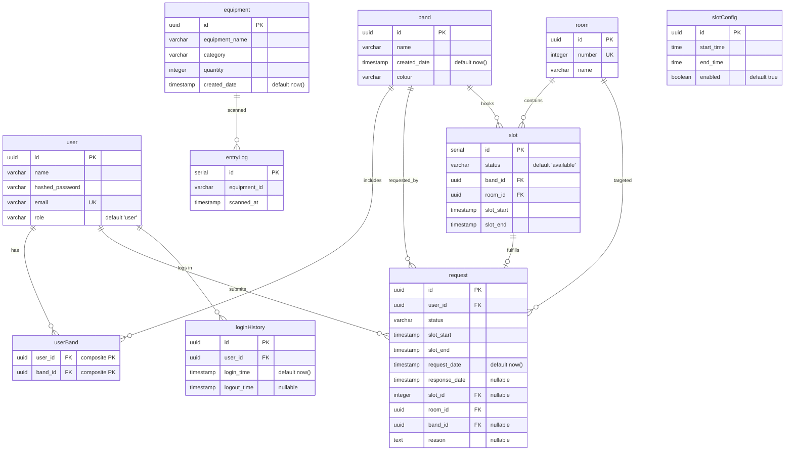
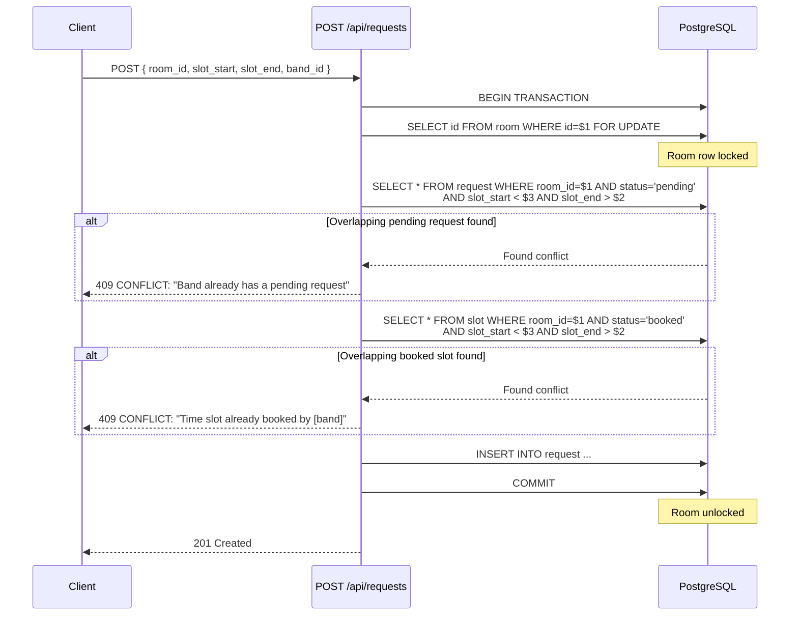

# Music Room Management System — Architecture Guide

## 1. Project Overview

A full-stack web application for managing music room bookings, slot requests, equipment tracking, and user administration at **SWO Kengeri Campus**. Students/staff can view room availability and submit booking requests; admins manage approvals, slot configuration, bands, and equipment.

### User Personas

| Role | Capabilities |
|------|-------------|
| **Visitor** (unauthenticated) | View the timetable at `/RoomBooking`, see the landing page at `/home`, sign in |
| **User** (authenticated) | Submit booking requests, view own requests, delete own requests |
| **Admin** (`role: "admin"`) | Approve/deny requests, manage slot configs, manage users/bands/equipment, view entry logs |

---

## 2. Tech Stack

| Layer | Technology | Purpose |
|-------|------------|---------|
| **Framework** | Next.js 15 (App Router) | Full-stack React framework, server-side rendering, API routes |
| **Language** | TypeScript | Type safety throughout |
| **Database** | PostgreSQL (Supabase) | Relational data with time-range queries |
| **ORM** | Drizzle ORM | Type-safe SQL with schema validation |
| **Auth** | NextAuth.js v4 (Credentials + JWT) | Email/password auth, no social providers |
| **Styling** | Tailwind CSS 3 | Utility-first CSS with custom glassmorphism design |
| **Animation** | Framer Motion 11 | UI transitions, modals, dropdowns, page loading |
| **Date/Time** | date-fns 4 | Calendar calculations, formatting |
| **Testing** | Playwright 1.61 | 202 API tests + 38 UI tests |
| **Deployment** | Vercel | Serverless Next.js hosting |

---

## 3. Architecture Overview

```
┌─────────────────────────────────────────────────────────────────────┐
│                           Browser                                   │
│  ┌──────────┐  ┌──────────┐  ┌───────────┐  ┌───────────────────┐ │
│  │ Visitor  │  │  User    │  │  Admin    │  │  Mobile Device    │ │
│  └────┬─────┘  └────┬─────┘  └─────┬─────┘  └────────┬──────────┘ │
│       │              │              │                   │            │
│       └──────────────┴──────────────┴───────────────────┘            │
│                              │                                      │
│                              ▼                                      │
│                     ┌────────────────┐                              │
│                     │  Next.js App   │                              │
│                     │  (App Router)  │                              │
│                     └───────┬────────┘                              │
└─────────────────────────────┼────────────────────────────────────────┘
                              │
              ┌───────────────┼───────────────────┐
              │               │                   │
              ▼               ▼                   ▼
    ┌─────────────────┐ ┌────────────┐ ┌──────────────────┐
    │   middleware.ts  │ │ Static UI  │ │   API Routes    │
    │ (route auth)     │ │ Components │ │  /api/*          │
    └────────┬────────┘ └────────────┘ └────────┬─────────┘
             │                                │
             │ (JWT check)                     │ (server-side)
             ▼                                ▼
    ┌────────────────┐              ┌──────────────────┐
    │  NextAuth.js   │              │  Drizzle ORM     │
    │  JWT decode     │              │  + pg.Pool       │
    └────────────────┘              └────────┬─────────┘
                                            │
                                            ▼
                                 ┌──────────────────┐
                                 │   PostgreSQL     │
                                 │  (Supabase)      │
                                 └──────────────────┘
```

### Request Lifecycle

1. **Page request** — Next.js resolves the route, `middleware.ts` checks JWT (if applicable)
2. **API request** — Client calls `/api/*`, handler validates auth via database session or token, queries DB via Drizzle ORM
3. **Booking write** — POST/PUT to `/api/requests` uses `db.transaction(...)` with `SELECT ... FOR UPDATE` on the room row
4. **Response** — API returns JSON; React components update optimistically

---

## 4. Directory Structure

```
├── app/                              # Next.js App Router pages + API
│   ├── (auth)/
│   │   ├── SignIn/                   # Login page (public)
│   │   └── layout.tsx                # Auth layout wrapper
│   ├── (root)/
│   │   ├── Dashboard/                # Slot configuration (admin)
│   │   ├── EntryLog/                 # Equipment entry logs (admin)
│   │   ├── EquipmentBooking/         # Equipment booking (admin)
│   │   ├── Register/                 # User & band management (admin)
│   │   ├── RoomBooking/              # Room timetable (public)
│   │   ├── SlotRequests/             # Slot request approval (admin)
│   │   └── home/                     # Landing page (public)
│   │   └── page.tsx                  # Redirects / → /RoomBooking
│   ├── api/
│   │   ├── auth/
│   │   │   ├── [...nextauth]/        # NextAuth handlers + authOptions
│   │   │   └── register/             # User registration POST
│   │   ├── bands/                    # Band CRUD
│   │   ├── entrylogs/                # Entry log GET
│   │   ├── equipment/                # Equipment POST
│   │   ├── requests/                 # Slot request CRUD (with transactions)
│   │   ├── rooms/                    # Room listing GET
│   │   ├── slotconfig/               # Slot config CRUD
│   │   ├── slots/                    # Slot GET + POST
│   │   └── users/                    # User CRUD
│   ├── globals.css                   # Tailwind + glassmorphism utilities
│   ├── layout.tsx                    # Root layout (Navbar, providers)
│   └── providers.tsx                 # SessionProvider, ThemeProvider
│
├── components/
│   ├── Navbar.tsx                    # Top nav: links, login/logout, mobile menu
│   ├── Branches.tsx                  # Branch info section (home page)
│   ├── Hero.tsx                      # Hero section with glowing stars
│   ├── Mission.tsx                   # Mission statement section
│   ├── ui/
│   │   ├── RBTable.tsx               # Room booking timetable (core component)
│   │   ├── SlotsRequestTable.tsx     # Request management table
│   │   ├── DashboardTable.tsx        # Slot config CRUD table
│   │   ├── Modal.tsx                 # Reusable glassmorphism modal
│   │   ├── TimePicker.tsx            # 12-hour time dropdown (06:00–21:00)
│   │   ├── DatePicker.tsx            # Client-side calendar popover
│   │   ├── ColorPicker.tsx           # HSV canvas + hex input
│   │   ├── BandMultiSelect.tsx       # Multi-band select with checkboxes
│   │   ├── ProfileDropdown.tsx       # Single-band select with colour dots
│   │   ├── RoomDropdown.tsx          # Numeric room selector
│   │   ├── FilterDropdown.tsx        # Generic filter dropdown
│   │   ├── EntryLogTable.tsx         # Equipment log display
│   │   ├── TableEquip.tsx            # Equipment booking table (mock data)
│   │   ├── MotionWrapper.tsx         # Fade-in animation wrapper
│   │   ├── RegistrationModal.tsx     # User registration form modal
│   │   ├── MagicButton.tsx           # Shimmer-animated button
│   │   ├── events.tsx               # Event cards with scroll reveal
│   │   ├── focus-cards.tsx           # Hover-reactive image grid
│   │   ├── glowing-stars.tsx         # Animated star background
│   │   ├── background-gradient.tsx   # Animated gradient container
│   │   └── text-generate-effect.tsx  # Word-by-word reveal
│   └── ...
│
├── db/
│   ├── index.ts                      # Global singleton pg.Pool + drizzle instance
│   ├── schema/                       # Drizzle table definitions + relations
│   │   ├── index.ts                  # Barrel export of all tables
│   │   ├── relations.ts             # Cross-table relation definitions
│   │   ├── user.ts, band.ts, userBand.ts
│   │   ├── room.ts, slot.ts, slotConfig.ts
│   │   ├── request.ts, equipment.ts, entryLog.ts
│   │   └── loginHistory.ts
│   └── migrations/                   # Auto-generated SQL migrations
│       ├── 0000_first_chamber.sql
│       └── meta/                     # Drizzle Kit meta files
│
├── tests/
│   ├── auth.setup.ts                 # Playwright auth fixture (logs in admin)
│   ├── roombooking-api.test.mjs      # 50 API tests
│   ├── slotrequests-api.test.mjs     # 60 API tests
│   ├── dashboard-api.test.mjs        # 32 API tests
│   ├── register-api.test.mjs         # 60 API tests
│   ├── roombooking-ui.spec.ts        # 10 Playwright UI tests
│   ├── slotrequests-ui.spec.ts       # 8 Playwright UI tests
│   ├── dashboard-ui.spec.ts          # 5 Playwright UI tests
│   ├── register-ui.spec.ts           # 6 Playwright UI tests
│   └── responsive-ui.spec.ts         # 9 mobile/tablet viewport tests
│
├── middleware.ts                      # Route-level JWT auth guard
├── playwright.config.ts               # Playwright config (6 projects)
├── vercel.json                        # Vercel deployment config
├── drizzle.config.ts                  # Drizzle Kit configuration
├── next.config.ts                     # Next.js configuration
├── tailwind.config.ts                 # Tailwind CSS configuration
├── global.d.ts                        # globalThis type augmentation for pool
├── next-auth.d.ts                     # NextAuth type augmentation (role, band_id)
└── lib/utils.ts                       # cn() helper (clsx + tailwind-merge)
```

---

## 5. Database Schema

### Entity Relationship Diagram



### Table Details

#### `user`
| Column | Type | Constraints |
|--------|------|-------------|
| `id` | `uuid` | `defaultRandom()`, PK |
| `name` | `varchar` | NOT NULL |
| `hashed_password` | `varchar` | NOT NULL |
| `email` | `varchar` | NOT NULL, UNIQUE |
| `role` | `varchar` | NOT NULL, default `'user'` |

#### `band`
| Column | Type | Constraints |
|--------|------|-------------|
| `id` | `uuid` | `defaultRandom()`, PK |
| `name` | `varchar` | NOT NULL |
| `created_date` | `timestamptz` | `defaultNow()`, NOT NULL |
| `colour` | `varchar` | NOT NULL |

#### `userBand` (many-to-many join)
| Column | Type | Constraints |
|--------|------|-------------|
| `user_id` | `uuid` | NOT NULL, FK → `user.id` ON DELETE CASCADE ON UPDATE CASCADE |
| `band_id` | `uuid` | NOT NULL, FK → `band.id` ON DELETE CASCADE ON UPDATE CASCADE |
| **PK** | | `(user_id, band_id)` composite |

#### `room`
| Column | Type | Constraints |
|--------|------|-------------|
| `id` | `uuid` | `defaultRandom()`, PK |
| `number` | `integer` | NOT NULL, UNIQUE |
| `name` | `varchar` | NOT NULL |

#### `slot`
| Column | Type | Constraints |
|--------|------|-------------|
| `id` | `serial` | PK (auto-increment) |
| `status` | `varchar` | NOT NULL, default `'available'` |
| `band_id` | `uuid` | FK → `band.id` (nullable) |
| `room_id` | `uuid` | NOT NULL, FK → `room.id` |
| `slot_start` | `timestamptz` | NOT NULL |
| `slot_end` | `timestamptz` | NOT NULL |

**Index:** `idx_slot_room_time` on `(room_id, slot_start, slot_end)` — composite index for time-range queries.

#### `slotConfig`
| Column | Type | Constraints |
|--------|------|-------------|
| `id` | `uuid` | `defaultRandom()`, PK |
| `start_time` | `time` (no date) | NOT NULL |
| `end_time` | `time` (no date) | NOT NULL |
| `enabled` | `boolean` | NOT NULL, default `true` |

#### `request`
| Column | Type | Constraints |
|--------|------|-------------|
| `id` | `uuid` | `defaultRandom()`, PK |
| `user_id` | `uuid` | NOT NULL, FK → `user.id` |
| `status` | `varchar` | NOT NULL |
| `slot_start` | `timestamptz` | NOT NULL |
| `slot_end` | `timestamptz` | NOT NULL |
| `request_date` | `timestamptz` | `defaultNow()`, NOT NULL |
| `response_date` | `timestamptz` | nullable |
| `slot_id` | `integer` | FK → `slot.id`, nullable |
| `room_id` | `uuid` | NOT NULL, FK → `room.id` |
| `band_id` | `uuid` | FK → `band.id`, nullable |
| `reason` | `text` | nullable |

**Index:** `idx_request_room_time` on `(room_id, slot_start, slot_end)` — composite index for conflict detection queries.

#### `equipment`
| Column | Type | Constraints |
|--------|------|-------------|
| `id` | `uuid` | `defaultRandom()`, PK |
| `equipment_name` | `varchar` | NOT NULL |
| `category` | `varchar` | NOT NULL |
| `quantity` | `integer` | NOT NULL |
| `created_date` | `timestamptz` | `defaultNow()`, NOT NULL |

#### `entryLog`
| Column | Type | Constraints |
|--------|------|-------------|
| `id` | `serial` | PK (auto-increment) |
| `equipment_id` | `varchar` | NOT NULL |
| `scanned_at` | `timestamptz` | NOT NULL |

#### `loginHistory`
| Column | Type | Constraints |
|--------|------|-------------|
| `id` | `uuid` | `defaultRandom()`, PK |
| `user_id` | `uuid` | NOT NULL, FK → `user.id` |
| `login_time` | `timestamptz` | `defaultNow()`, NOT NULL |
| `logout_time` | `timestamptz` | nullable |

---

## 6. Authentication & Authorization

### NextAuth Configuration (`app/api/auth/[...nextauth]/authOptions.ts`)

- **Provider:** `CredentialsProvider` — email + password
- **Strategy:** `"jwt"` (no database sessions for simplicity)
- **Password hashing:** `bcryptjs` with 10 salt rounds

### JWT Callback Flow

```
credentials → authorize(email, password)
  ├─ Query user by email
  ├─ bcrypt.compare(password, hashed_password)
  └─ Return { id, name, email, role, band_id }
        │
jwt({ token, user }) ───→ token gets { id, email, name, role, band_id }
        │
session({ session, token }) ──→ session.user gets { id, email, name, role, band_id }
```

### Session Events

- **`signIn`:** Inserts a row in `loginHistory` with `login_time = now()`, `logout_time = null`
- **`signOut`:** Updates the most recent `loginHistory` row (where `logout_time IS NULL`) with `logout_time = now()`

### Middleware Route Protection (`middleware.ts`)

`middleware.ts` uses `getToken` from `next-auth/jwt` to check for a valid JWT on every request. The `matcher` config defines which routes require authentication:

```typescript
matcher: ["/((?!api|_next/static|_next/image|favicon.ico|SignIn|RoomBooking|home).+)"]
```

| Route | Public | Notes |
|-------|--------|-------|
| `/` | ✅ | Redirects to `/RoomBooking` |
| `/RoomBooking` | ✅ | Timetable viewable by anyone |
| `/home` | ✅ | Landing page |
| `/SignIn` | ✅ | Login form |
| `/api/*` | ✅ | API routes handle their own auth |
| `/Dashboard` | ❌ | Requires auth + admin role check in component |
| `/Register` | ❌ | Requires auth + admin role check in component |
| `/SlotRequests` | ❌ | Requires auth + admin role check in component |
| `/EntryLog` | ❌ | Requires auth + admin role check in component |
| `/EquipmentBooking` | ❌ | Requires auth |

### Frontend Role Checks

Components check `session?.user?.role === 'admin'`:
- **Navbar**: Admin-only links (`/Register`, `/Dashboard`, `/SlotRequests`, `/EntryLog`) are hidden from non-admins
- **SlotsRequestTable**: Approve/deny/edit buttons only visible to admin
- **RBTable**: Booking modal doesn't show admin-only fields for non-admins
- **Register page**: Entire page checks role before rendering

---

## 7. API Routes Reference

### `/api/auth/register` — POST
| Field | Type | Required | Default |
|-------|------|----------|---------|
| `name` | string | ✅ | — |
| `email` | string | ✅ | — |
| `password` | string | ✅ | — |
| `role` | string | ❌ | `'user'` |
| `bandIds` | string[] | ❌ | `[]` |

**Logic:** Validate required fields → check email uniqueness → `bcrypt.hash(password, 10)` → insert into `user` → insert `userBand` rows if `bandIds` → re-fetch with band join → return 201.

### `/api/requests` — GET, POST, PUT, DELETE

#### GET — List requests
| Query Param | Type | Description |
|------------|------|-------------|
| `room_id` | string (optional) | Filter by room |
| `user_id` | string (optional) | Filter by user |

**Response:** Array of requests, left-joined with `user` and `band`, ordered by `request_date DESC`.

#### POST — Create request (with conflict detection)
| Field | Type | Required |
|-------|------|----------|
| `user_id` | string | ✅ |
| `room_id` | string | ✅ |
| `slot_start` | ISO string | ✅ |
| `slot_end` | ISO string | ✅ |
| `band_id` | string | ❌ (uses first band if omitted) |
| `reason` | string | ❌ |

**Atomic transaction logic:**
```
db.transaction((tx) => {
  1. tx.execute(sql`SELECT id FROM room WHERE id = ${room_id} FOR UPDATE`)
     → Lock the room row (blocks concurrent booking attempts)
  
  2. Check for existing pending request by same band/room with overlapping times
     → If found → throw CONFLICT: message with band name
  
  3. Check for existing booked slot in same room with overlapping times
     → If found → throw CONFLICT: message with booking band
  
  4. Insert request with status "pending"
     → Return created request
})
```

**No lock timeout or deadlock handling** — the transaction is short-lived (4 fast queries), so contention is minimal.

#### PUT — Update request
| Query Param | Type | Required |
|------------|------|----------|
| `id` | string | ✅ |

**Body:** Any subset of `{ status, slot_start, slot_end, band_id, user_id, reason, request_date, response_date }`

**Approval flow (status → `"approved"`):**
```
db.transaction((tx) => {
  1. SELECT FOR UPDATE on room
  2. Check for overlapping booked slots (excluding own previous slot)
  3. If not previously approved → INSERT new slot record with status "booked"
  4. If previously approved    → UPDATE existing slot's time range
})
```

**Rejection flow (status → anything else):**
- If previously approved and has `slot_id` → transaction: nullify `request.slot_id` → DELETE slot
- Otherwise → simple update

#### DELETE — Delete request
| Query Param | Type | Required |
|------------|------|----------|
| `id` | string | ✅ |

**Logic:** If `slot_id` exists → nullify FK → delete slot → delete request.

### `/api/slots` — GET, POST

#### GET — Query booked slots
| Query Param | Type | Description |
|------------|------|-------------|
| `start` | ISO string | Filter slot_start >= start |
| `end` | ISO string | Filter slot_start <= end |
| `roomNumber` | integer | Filter by room number |

#### POST — Direct slot booking
| Field | Type | Required |
|-------|------|----------|
| `slot_start` | ISO string | ✅ |
| `slot_end` | ISO string | ❌ (defaults to same as start) |
| `band_id` | string | Optional |
| `room_id` | string | Optional |

**Logic:** Find existing slot by `slot_start + room_id` → if found and booked → 400 error → else update to booked → else insert new.

### `/api/slotconfig` — GET, POST, PUT, DELETE
Full CRUD on `slot_config` table. Simple operations with existence checks on PUT/DELETE (404 if not found).

### `/api/bands` — GET, POST, PUT, DELETE
Full CRUD on `band` table. Simple operations with existence checks.

### `/api/users` — GET, PUT, DELETE

#### GET — List users with bands
Left-joins `user` → `userBand` → `band`. Groups into in-memory structure:
```json
{ "id": "...", "name": "...", "email": "...", "role": "...", "bands": [{ "id": "...", "name": "..." }] }
```

#### PUT — Update user
| Query Param | Type | Required |
|------------|------|----------|
| `id` | string | ✅ |

If `bandIds` is provided, deletes all existing `userBand` entries and inserts new ones (full replacement).

### `/api/equipment` — POST
Create equipment record. Validates `equipment_name`, `category`, `quantity`.

### `/api/entrylogs` — GET
Returns entry logs joined with equipment table, ordered by `scanned_at DESC`.

### `/api/rooms` — GET
Returns all rooms ordered by `number ASC`.

---

## 8. Frontend Pages & Components

### Page Summary

| Page | Route | Access | Key Feature |
|------|-------|--------|-------------|
| **Room Booking** | `/RoomBooking` | Public | Weekly timetable, room selector, booking modal |
| **Slot Requests** | `/SlotRequests` | Admin | Approve/deny/edit, filters, search, pagination |
| **Dashboard** | `/Dashboard` | Admin | Slot config CRUD, time pickers, enable/disable |
| **Register** | `/Register` | Admin | User + band management, ColorPicker, BandMultiSelect |
| **Entry Log** | `/EntryLog` | Admin | Equipment scan log viewer |
| **Equipment Booking** | `/EquipmentBooking` | Auth | Equipment table (mock data currently) |
| **Home** | `/home` | Public | Hero, Mission, Branches, Events sections |
| **Sign In** | `/SignIn` | Public | Login form |
| **Root** | `/` | Public | Redirects to `/RoomBooking` |

### Key Components

#### `Navbar.tsx`
- Fixed top bar, hides on scroll-down, shows on scroll-up
- Desktop links with active indicator (purple dot)
- Mobile hamburger menu with `AnimatePresence` animation
- Inline login modal + RegistrationModal
- Admin-only links conditionally rendered

#### `RBTable.tsx` (Room Booking Table — core component)
- **Week navigation:** prev/next chevrons, "Today" button, date picker trigger
- **Room selector:** `RoomDropdown` to switch between rooms
- **Grid layout:** Rows = time slots (from `slotConfig`), Columns = days of week
- **Booking display:** Cells coloured by band colour, row-span merged for consecutive same-band bookings
- **Booking modal:** Opens on cell click — shows band selector (ProfileDropdown), date+time fields, reason
- **Week cache:** `useRef<Map<string, CacheEntry>>` — max 20 entries, cache-first, cleared on new booking
- **Scroll-edge gradient:** Right-edge gradient overlay when table overflows horizontally
- **Animation:** `AnimatePresence mode="wait"` around table with 0.1s crossfade on week navigation

#### `SlotsRequestTable.tsx`
- **Filters:** Room, status (pending/approved/rejected), date, text search
- **Action buttons:** Admin sees approve/deny/edit; all users see delete
- **Edit modal:** Room/Date/Time in `flex-col sm:flex-row`, Status + Reason full-width
- **Pagination:** 7 per page, ellipsis truncation
- **Error display:** 409 conflict errors show conflicting band name

#### `DashboardTable.tsx`
- **Add row:** Two TimePicker inputs + "Add Slot" button at top
- **Table columns:** ID, Start, End, Status badge, Actions (toggle enabled/disabled, delete)
- **12-hour display:** All times converted via `to12Hour` helper

#### `Modal.tsx` (Reusable)
- `AnimatePresence` with scale + opacity animation (0.2s)
- Backdrop click to close (with `e.stopPropagation()`)
- Glassmorphism styling: `bg-black/50 backdrop-blur-xl border-white/20 rounded-3xl`

#### `TimePicker.tsx`
- Generates times from 06:00 to 21:30 in 30-minute increments
- Displays in 12-hour AM/PM format
- Click-outside-to-close, `AnimatePresence` dropdown
- Custom scrollbar: `max-h-40 overflow-y-auto`

#### `DatePicker.tsx` (Custom)
- Pure client-side calendar (no external library)
- Month navigation, today highlight, selected highlight
- Grid calculated from `date-fns` helpers

#### `ColorPicker.tsx`
- HSV canvas (saturation-value square) drawn via `<canvas>` API
- Hue slider: native `<input type="range">` with rainbow gradient
- Hex text input with validation
- Marker position tracks s/v coordinates
- Click-outside-to-close

#### `BandMultiSelect.tsx`
- Multiple band selection with checkbox UI
- Display: comma-joined selected band names
- Click-outside-to-close, animated dropdown

#### `ProfileDropdown.tsx`
- Single band selection with colour dot + name
- Used for booking modal (selecting which band is booking)

#### `EntryLogTable.tsx`, `TableEquip.tsx`
- Glassmorphism-styled tables
- Scroll-edge gradient, pagination ellipsis
- Category icons map (guitar, instrument, mic, user)

### Reusable UI Patterns

All dropdowns follow the same pattern:

```typescript
// 1. Click-outside-to-close
const ref = useRef<HTMLDivElement>(null);
useEffect(() => {
  function handleClick(e: MouseEvent) {
    if (ref.current && !ref.current.contains(e.target as Node)) setIsOpen(false);
  }
  document.addEventListener("mousedown", handleClick);
  return () => document.removeEventListener("mousedown", handleClick);
}, []);

// 2. AnimatePresence dropdown
<AnimatePresence>
  {isOpen && (
    <motion.div initial={{ opacity: 0, y: -8, scale: 0.95 }}
                animate={{ opacity: 1, y: 0, scale: 1 }}
                exit={{ opacity: 0, y: -8, scale: 0.95 }}
                transition={{ duration: 0.15 }}>
      ...options...
    </motion.div>
  )}
</AnimatePresence>
```

Scroll-edge gradient indicator:

```typescript
const [isScrolled, setIsScrolled] = useState(false);
const handleScroll = (e: React.UIEvent) => {
  const t = e.currentTarget;
  setIsScrolled(t.scrollLeft + t.clientWidth < t.scrollWidth - 2);
};
// Renders: absolute right-edge gradient when isScrolled is true
```

Pagination ellipsis pattern:

```typescript
const getPageNumbers = (current: number, total: number) => {
  const range: (number | "...")[] = [];
  for (let i = 1; i <= total; i++) {
    if (i === 1 || i === total || (i >= current - 1 && i <= current + 1)) range.push(i);
    else if (range[range.length - 1] !== "...") range.push("...");
  }
  return range;
};
```

---

## 9. Data Flows

### Booking Flow (End-to-End)

```
 USER                           BROWSER                         API                          DB
  │                               │                              │                            │
  │ 1. Select room + week         │                              │                            │
  │───→                          │                              │                            │
  │                               │──GET /api/slots?start=...──→─│                            │
  │                               │                              │──SELECT slot, band, room──→│
  │                               │←──────── JSON ──────────────│←────── booked slots ───────│
  │                               │                              │                            │
  │ 2. Click empty cell           │                              │                            │
  │───→                          │                              │                            │
  │                               │  Open booking modal          │                            │
  │                               │  (check auth → login prompt  │                            │
  │                               │   if unauthenticated)         │                            │
  │ 3. Fill form + submit         │                              │                            │
  │───→                          │                              │                            │
  │                               │──POST /api/requests─────────→│                            │
  │                               │                              │──db.transaction───────────→│
  │                               │                              │  1. SELECT ... FOR UPDATE  │
  │                               │                              │  2. Check overlap (pending)│
  │                               │                              │  3. Check overlap (booked) │
  │                               │                              │  4. INSERT request         │
  │                               │←── 201 / 409 ───────────────│←───────── done ────────────│
  │  ←── success / error msg      │                              │                            │
  │                               │                              │                            │
 ```

### Approval Flow (Admin)

```
 ADMIN                          BROWSER                         API                          DB
  │                               │                              │                            │
  │ 1. Open /SlotRequests         │                              │                            │
  │───→                          │                              │                            │
  │                               │──GET /api/requests───────────→│                            │
  │                               │                              │──SELECT request + joins───→│
  │                               │←────── all requests ────────│←───── JSON ────────────────│
  │                               │                              │                            │
  │ 2. Click ✅ Approve           │                              │                            │
  │───→                          │                              │                            │
  │                               │──PUT /api/requests?id=...───→│                            │
  │                               │  { status: "approved" }      │                            │
  │                               │                              │──db.transaction───────────→│
  │                               │                              │  1. SELECT ... FOR UPDATE  │
  │                               │                              │  2. Check overlap (booked) │
  │                               │                              │  3. INSERT slot            │
  │                               │                              │  4. UPDATE request         │
  │                               │←── 200 + updated request ───│←───────── done ────────────│
  │  ←── table updates            │                              │                            │
  │                               │                              │                            │
  │ 3. Click ❌ Deny              │                              │                            │
  │───→                          │                              │                            │
  │                               │──PUT /api/requests?id=...───→│                            │
  │                               │  { status: "rejected" }      │                            │
  │                               │                              │  IF had slot_id:           │
  │                               │                              │    db.transaction:         │
  │                               │                              │    nullify request.slot_id │
  │                               │                              │    DELETE slot             │
  │                               │                              │  ELSE: simple UPDATE       │
  │                               │←── 200 ─────────────────────│                            │
```

### Overlap Detection Logic



### Week Cache Strategy (RBTable)

```typescript
type WeekCacheKey = `${weekStartISO}-${roomNumber}`;  // e.g. "2026-06-22-1"
interface WeekCacheEntry {
  days: Day[];
  timeSlots: TimeSlot[];
  bookings: Booking[];
}

const cache = useRef<Map<WeekCacheKey, WeekCacheEntry>>(new Map());
const MAX_CACHE = 20;

function loadWeek(weekStart: Date, roomNumber: number) {
  const key = `${weekStart.toISOString().slice(0,10)}-${roomNumber}`;
  if (cache.current.has(key)) {
    skipAnimation.current = true;
    setState(cache.current.get(key)!);
    return;
  }
  fetchData(weekStart, roomNumber).then((data) => {
    if (cache.current.size >= MAX_CACHE) cache.current.delete(cache.current.keys().next().value);
    cache.current.set(key, data);
    setState(data);
  });
}

// On booking: cache.current.clear()
```

---

## 10. Design System

### Glassmorphism Tokens

| Element | Classes |
|---------|---------|
| **Card/Container** | `bg-white/5 backdrop-blur-md border border-white/10 rounded-3xl` |
| **Input** | `bg-white/10 border-white/20 rounded-xl text-white font-mono` |
| **Primary Button** | `bg-gradient-to-r from-indigo-500 via-purple-500 to-pink-500 text-white` |
| **Ghost Button** | `hover:bg-white/10 transition-colors` |
| **Modal** | `bg-black/50 backdrop-blur-xl border border-white/20 rounded-3xl` |
| **Table Header** | `bg-gray-900 sticky top-0 z-10` |
| **Table Cell** | `font-mono` + `gray-400` (band/user columns) or `gray-500` (date columns) |
| **Dropdown** | `bg-gray-900 border border-white/10 rounded-xl` |

### Typography

- **`font-mono` everywhere** — table cells, form inputs, labels, action buttons, time displays
- **Responsive headings** — `text-xl sm:text-2xl` for page titles, `text-[28px] sm:text-[40px] md:text-5xl lg:text-6xl` for hero

### Time Format

| Context | Format | Example |
|---------|--------|---------|
| **Frontend (display)** | 12-hour AM/PM | `7:30 AM` |
| **Frontend (internal value)** | 24-hour HH:mm | `07:30` |
| **Backend (DB)** | PostgreSQL TIME | `07:30:00` |
| **Backend (timestamp)** | ISO 8601 | `2026-06-22T07:30:00.000Z` |

The `to12Hour` helper converts `"HH:mm"` → `"h:mm AM/PM"`:
```typescript
const to12Hour = (time: string) => {
  const [h, m] = time.split(":").map(Number);
  const ampm = h >= 12 ? "PM" : "AM";
  return `${h === 0 ? 12 : h > 12 ? h - 12 : h}:${m.toString().padStart(2, "0")} ${ampm}`;
};
```

### Responsive Breakpoints (Default Tailwind)

| Breakpoint | Min Width | Usage |
|------------|-----------|-------|
| `sm` | 640px | Horizontal layouts, larger padding |
| `md` | 768px | Tablet column layouts |
| `lg` | 1024px | Desktop hero text size |
| `xl` | 1280px | Full width containers |

Key patterns across all pages:
- `px-4 sm:px-10` — responsive horizontal padding on `<main>`
- `flex-col sm:flex-row` — column on mobile, row on desktop for modal fields
- `p-2 sm:p-4` — responsive padding in table cells
- `py-3 sm:py-2.5` — responsive tap targets on mobile

---

## 11. Testing Strategy

### Test Stack

- **Framework:** Playwright 1.61
- **Projects:** 6 (shared auth setup + 5 test projects)
- **Total tests:** 202 API tests + 38 UI tests

### Playwright Configuration

```typescript
projects: [
  { name: "setup", testMatch: "auth.setup.ts" },       // Admin login fixture
  { name: "roombooking", dependencies: ["setup"] },     // 10 UI tests
  { name: "slotrequests", dependencies: ["setup"] },    // 8 UI tests
  { name: "dashboard", dependencies: ["setup"] },       // 5 UI tests
  { name: "register", dependencies: ["setup"] },        // 6 UI tests
  { name: "responsive", dependencies: ["setup"] },      // 9 viewport tests
]
```

### API Tests (Pure Node.js, no Playwright)

Each `*-api.test.mjs` file uses `fetch()` directly against the dev server or production URL: 202 tests total across 4 suites. No dev server dependency — they can run against any running instance by setting `BASE_URL` env var.

| Suite | File | Tests | What It Covers |
|-------|------|-------|----------------|
| Room Booking | `roombooking-api.test.mjs` | 50 | Room listing, slot queries, direct booking, overlap detection |
| Slot Requests | `slotrequests-api.test.mjs` | 60 | CRUD + conflict detection 409 on POST + PUT, FK cleanup |
| Dashboard | `dashboard-api.test.mjs` | 32 | Slot config CRUD, validation, 404 handling |
| Register | `register-api.test.mjs` | 60 | User CRUD, band CRUD, user-band relationships |

### API Test Pattern

```javascript
const BASE = process.env.BASE_URL || "http://localhost:3000";

async function test(name, fn) {
  try { await fn(); console.log(`  ✅ ${name}`); }
  catch (e) { console.log(`  ❌ ${name}: ${e.message}`); process.exitCode = 1; }
}

// Tests use fetch() + .json() directly
await test("GET /api/rooms returns rooms", async () => {
  const res = await fetch(`${BASE}/api/rooms`);
  assert.equal(res.status, 200);
  const body = await res.json();
  assert(Array.isArray(body));
});
```

### UI Tests (Playwright)

| Suite | Tests | What It Covers |
|-------|-------|----------------|
| Room Booking | 10 (F1–F15) | Table render, week nav, booking flow, cache, mobile |
| Slot Requests | 8 (S1–S8) | Filtering, approve/deny, edit, delete |
| Dashboard | 5 (D1–D6) | Add/edit/toggle/delete slot configs |
| Register | 6 (R1–R6) | User CRUD, band CRUD, ColorPicker, BandMultiSelect |
| Responsive | 9 | Mobile (390×844) + Tablet (768×1024) viewports |

### Running Tests

```bash
# API tests (any running instance)
npm run test:api                               # 50 roombooking tests
node tests/slotrequests-api.test.mjs           # 60 slot requests tests
node tests/dashboard-api.test.mjs              # 32 dashboard tests
node tests/register-api.test.mjs               # 60 register tests

# UI tests (require dev server)
npm run dev &                                  # Start server
npm run test:ui                                # All UI tests
npx playwright test --project=roombooking      # Single project
npx playwright test --headed                    # Visible browser

# Against production
BASE_URL=https://your-app.vercel.app node tests/roombooking-api.test.mjs
```

### Known Test Quirks

- Playwright `getByText` is case-insensitive and fails on multiple matches → use heading roles or `locator("button").filter({ hasText: })`
- ColorPicker trigger targeted via `locator("button").filter({ hasText: "#ffffff" })` because `getByText` matches both trigger and table cells
- `/api/users` returns `bands` (lowercase b), while register returns `Bands` (capital B)
- PostgreSQL `TIME` type returns `06:00:00` (with `:00` suffix) not `06:00`

---

## 12. Deployment

### Vercel Configuration

**`vercel.json`:**
```json
{
  "framework": "nextjs",
  "installCommand": "npm install --legacy-peer-deps"
}
```

**`next.config.ts`** key settings:
```typescript
serverExternalPackages: ["pg", "bcryptjs"], // Ensure these are bundled server-side
eslint: { ignoreDuringBuilds: true },       // ESLint flat config incompatibility workaround
```

### Environment Variables

| Variable | Description |
|----------|-------------|
| `DATABASE_URL` | Supabase PostgreSQL connection string with `?pgbouncer=true` (pooler port 6543) |
| `NEXTAUTH_SECRET` | Random base64 encryption key for JWT |
| `NEXTAUTH_URL` | Vercel deployment URL (e.g., `https://music-room-management-system.vercel.app`) |

### Serverless Database Pattern (`db/index.ts`)

```typescript
import { Pool } from "pg";
import { drizzle } from "drizzle-orm/node-postgres";

const createPool = () => new Pool({
  connectionString: process.env.DATABASE_URL,
  ssl: { rejectUnauthorized: false },
  max: 10,
  idleTimeoutMillis: 10000,
  connectionTimeoutMillis: 30000,
});

// Global singleton for Vercel serverless (avoids connection exhaustion)
globalThis.__dbPool ??= createPool();
const pool = globalThis.__dbPool;

export const db = drizzle(pool, { schema });
export const schema = schema;
export default db;
```

### Migration Strategy

- **On deploy:** `npx drizzle-kit migrate` runs via `postinstall` script
- **On failure:** `|| echo 'Migration skipped'` — graceful fallback if DB unreachable during build
- **Manual:** `npx drizzle-kit migrate` or `npm run db:migrate`
- **New migrations:** `npx drizzle-kit generate` or `npm run db:generate`

### Build Command

```bash
npm install --legacy-peer-deps   # --legacy-peer-deps required for React 19 RC peer conflicts
npx drizzle-kit migrate || echo   # Apply DB migrations (non-fatal)
npx next build                    # Production build
```

---

## 13. Key Technical Decisions

### 13.1 Race Condition Protection — `SELECT ... FOR UPDATE`

**Problem:** Two concurrent POST requests to `/api/requests` could both pass the overlap check before either inserts, resulting in double-booking.

**Solution:** Wrap the conflict check + insert in a `db.transaction` with `SELECT ... FOR UPDATE` on the room row:

```typescript
await db.transaction(async (tx) => {
  await tx.execute(sql`SELECT id FROM room WHERE id = ${room_id} FOR UPDATE`);
  // Exclusive lock acquired on the room row
  // All subsequent reads in this transaction see a consistent snapshot
  // Other transactions attempting to lock the same room will wait
  // ...overlap checks...
  // ...insert...
}); // Lock released on COMMIT
```

**Alternatives considered vs chosen:**
- **Option A (Exclusion constraint):** PostgreSQL `EXCLUDE USING gist (... WITH &&)` — rejected to avoid schema changes
- **Option B (FOR UPDATE):** Chosen — per-room serialization, no schema changes, sufficient for expected load

### 13.2 Serverless Database Connection

**Problem:** Vercel serverless functions can create many concurrent connections, exhausting the Supabase pool (15 connections limit on free tier).

**Solution:** Global singleton `Pool` stored on `globalThis`. In serverless, `globalThis` persists across invocations within the same warm instance, reusing the same pool. Declared in `global.d.ts`:

```typescript
declare global { var __dbPool: Pool | undefined; }
```

### 13.3 Middleware vs `withAuth`

**Problem:** Need to protect admin routes while keeping `/RoomBooking`, `/home`, `/SignIn`, and `/api/*` public.

**Solution:** Custom `middleware.ts` using `getToken` from `next-auth/jwt` instead of NextAuth's `withAuth` middleware. This gives explicit per-route control via the `matcher` config and avoids wrapping every page in `getServerSession` calls.

### 13.4 Scrollbar Flicker Fix

**Problem:** Navigation between pages causes a brief layout shift as scrollbars appear/disappear.

**Solution:** `overflow-y: hidden` on mount → `overflow-y: auto` after mount, applied via `useEffect` + state toggle. This prevents the initial flicker while maintaining scrollability once the page is rendered.

### 13.5 Routing Architecture

**Problem:** The original home page (Hero, Mission, Branches, Events) needed to coexist with the room booking timetable as the default landing page.

**Solution:**
- `/` redirects to `/RoomBooking` (most-visited page)
- `/home` serves the original marketing content
- Navbar "Home" link points to `/home`
- Both `/RoomBooking` and `/home` are public (unauthenticated)

### 13.6 Time Format Split

**Problem:** Users prefer 12-hour AM/PM for readability, but the database stores PostgreSQL `TIME` type which is most naturally handled as 24-hour.

**Solution:** All frontend displays use `to12Hour` conversion. All internal state/storage uses `HH:mm` for compatibility with DB `TIME` values (which return as `"HH:mm:ss"`).

### 13.7 Week Cache Strategy

**Problem:** Navigating between weeks in the timetable re-fetches the entire week's data, causing visible loading states.

**Solution:** `useRef<Map>` with a key of `${weekISO}-${roomNumber}`, max 20 entries. Cache is checked on week navigation; if found, data is loaded instantly and animation is skipped. Cache is cleared on any successful booking mutation (so the updated timetable is fetched fresh).

### 13.8 ESLint Flat Config Incompatibility

**Problem:** `eslint.config.mjs` uses `FlatCompat` to bridge old-style `.eslintrc` configs. Next.js's ESLint runner passes `useEslintrc` and `extensions` options valid only for ESLint 8, which fail against ESLint 9's flat config format.

**Solution:** `eslint: { ignoreDuringBuilds: true }` in `next.config.ts`. Linting runs separately via `npm run lint` with the same config, which works correctly when invoked directly.

---

## 14. Component Tree

```
<RootLayout>
  <SessionProvider>
    <ThemeProvider attribute="class" defaultTheme="dark">
      <Navbar>                              ← Fixed top nav
        ├── Logo + "Home" link             → /home
        ├── Desktop nav links              → conditional on role
        ├── Auth buttons (Login / Logout)  → opens Modal or signs out
        └── Mobile hamburger menu          → AnimatePresence panel (same links)
      </Navbar>
      <main>                                ← px-4 sm:px-10
        {children}                           ← Page content
      </main>
    </ThemeProvider>
  </SessionProvider>
</RootLayout>

┌── Page: /RoomBooking ─────────────────────────────────────────────────┐
│  <MotionWrapper>                                                       │
│    <h1> + <AnimatePresence mode="wait">                               │
│      <RBTable>                                                         │
│        ├── RoomDropdown                     ← Room selector           │
│        ├── Week navigation bar              ← Prev/Today/Next/Date    │
│        ├── <div onScroll={handleScroll}>                              │
│        │   ├── Table header (days of week)  ← sticky bg-gray-900     │
│        │   └── Table body                   ← time slots × days      │
│        │       └── Booked cells             ← band colour bg,        │
│        │            row-span merged          ← consecutive same-band   │
│        └── Gradient overlay (if scrolled)   ← pointer-events-none     │
│      </RBTable>                                                        │
│    </AnimatePresence>                                                  │
│  </MotionWrapper>                                                      │
│                                                                        │
│  <Modal> ← Booking / Status / Login-Required                           │
│    ├── "Book Slot": TimePicker, DatePicker, ProfileDropdown, Reason    │
│    ├── "Status": booked info + optional delete                         │
│    └── "Login Required": prompt to sign in                             │
│  </Modal>                                                              │
└────────────────────────────────────────────────────────────────────────┘

┌── Page: /SlotRequests ────────────────────────────────────────────────┐
│  <SlotsRequestTable>                                                   │
│    ├── RoomDropdown + FilterDropdown + DatePicker + Search input      │
│    ├── <div onScroll={handleScroll}>                                  │
│    │   └── Table (User, Band, Room, Slot, Status, Actions)            │
│    └── Pagination (prev / ... / pages / ... / next)                    │
│                                                                        │
│    <Modal> ← Edit Request                                              │
│      └── EditRequestForm: RoomDropdown, DatePicker, TimePicker,        │
│          Status toggle, Reason input                                   │
│    </Modal>                                                            │
│  </SlotsRequestTable>                                                  │
└────────────────────────────────────────────────────────────────────────┘

┌── Page: /Dashboard ───────────────────────────────────────────────────┐
│  <DashboardTable>                                                      │
│    ├── Add row: TimePicker(Start) + TimePicker(End) + Add button      │
│    ├── Table (ID, Start, End, Status, Actions)                         │
│    └── Pagination                                                      │
│  </DashboardTable>                                                     │
└────────────────────────────────────────────────────────────────────────┘

┌── Page: /Register ────────────────────────────────────────────────────┐
│  Two-panel glassmorphism layout                                        │
│  ├── Panel 1: "Register User"                                         │
│  │   ├── Name, Email, Password inputs                                 │
│  │   ├── BandMultiSelect                                               │
│  │   └── Gradient "Register" button                                    │
│  ├── Panel 2: "Users" table                                            │
│  │   └── Table with edit/delete                                        │
│  ├── Panel 3: "Create Band"                                            │
│  │   ├── Name input                                                    │
│  │   └── ColorPicker                                                   │
│  └── Panel 4: "Bands" table                                            │
│      └── Table with edit/delete                                        │
└────────────────────────────────────────────────────────────────────────┘

┌── Page: /EntryLog ────────────────────────────────────────────────────┐
│  <EntryLogTable refreshCount={refreshCount}                            │
│                searchQuery={search}                                    │
│                filterCategory={category}                               │
│                filterDate={date}>                                      │
│    ├── Filters: Search + Category + Date                               │
│    ├── Table (S.No, Name, Category, Time) ← glassmorphism              │
│    └── Pagination                                                      │
│  </EntryLogTable>                                                      │
└────────────────────────────────────────────────────────────────────────┘

┌── Page: /home ────────────────────────────────────────────────────────┐
│  <Hero>                                                                │
│    ├── GlowingStarsBackground                                          │
│    ├── TextGenerateEffect ("Student Welfare Office Kengeri")           │
│    └── Subtitle                                                        │
│  <Mission />                                                           │
│  <Branches />                                                          │
│  <EventsPage />                                                        │
│    └── Event cards with scroll-triggered fade-in                       │
└────────────────────────────────────────────────────────────────────────┘

┌── Page: /SignIn ──────────────────────────────────────────────────────┐
│  <SignInPage>                                                          │
│    └── Glassmorphism card with email/password form                     │
└────────────────────────────────────────────────────────────────────────┘
```

---

## 15. Error Handling Patterns

### API Error Handling

| Scenario | HTTP Status | Response |
|----------|-------------|----------|
| Missing required field | 400 | `{ error: "user_id is required" }` |
| Resource not found | 404 | `{ error: "Request not found" }` |
| Overlapping booking | 409 | `{ error: "CONFLICT: Band X already has a pending request" }` |
| Server error | 500 | `{ error: "Internal server error" }` |

### FK Safety — Slot Deletion

When rejecting or deleting an approved request that has a `slot_id` link, the `request_slot_id_fkey` constraint would cause a violation if we delete the slot first. The fix is a two-step approach:

```typescript
// 1. Nullify the FK reference on the request
await db.update(requestsTable).set({ slot_id: null }).where(eq(requestsTable.id, requestId));
// 2. Delete the slot
await db.delete(slotsTable).where(eq(slotsTable.id, slotId));
// 3. Update or delete the request
await db.delete(requestsTable).where(eq(requestsTable.id, requestId));
```

This is always wrapped in a transaction when part of the approval/rejection PUT handler.

### Frontend Error Display

- **Inline error messages:** Shown below the submit button in modals
- **Conflict formatting:** `formatError` helper in `SlotsRequestTable.tsx` strips the `CONFLICT:` prefix and displays just the human-readable message
- **Toast patterns:** Not used — errors are displayed inline in the modal or as alert text

---

## 16. Performance Considerations

### Database

- **Composite indexes** on `slot(room_id, slot_start, slot_end)` and `request(room_id, slot_start, slot_end)` accelerate overlap detection queries
- **`FOR UPDATE` row-level locking** is scoped to a single room row — contention is minimal as different rooms are independent
- **No N+1 queries** — Drizzle relations and explicit joins batch related data

### Frontend

- **Week cache** avoids redundant API calls for previously-viewed week + room combinations
- **`useMemo`** for row-span merging calculations in RBTable, preventing recalculation on unrelated re-renders
- **`MotionWrapper`** uses simple `framer-motion` fade-in (not layout animations) for performance
- **Pagination** limits DOM rendering to 7–10 items per page on all table components
- **Font-mono** on all text avoids layout shift from font loading (monospace has consistent character width)

### Vercel Serverless

- **Global pool reuse** avoids cold-start connection overhead on warm instances
- **`serverExternalPackages`** ensures `pg` and `bcryptjs` are bundled correctly for serverless
- **`--legacy-peer-deps`** resolves React 19 RC peer dependency conflicts without affecting production bundle size

---

## 17. Dependencies Scripts Guide

| Script | What It Does | Notes |
|--------|-------------|-------|
| `npm run dev` | `next dev` — starts dev server |
| `npm run build` | `next build` — production build | Runs ESLint (ignored), generates static pages |
| `npm run start` | `next start` — starts production server |
| `npm run lint` | `next lint` — runs ESLint | Works standalone despite build flag |
| `npm run db:generate` | `drizzle-kit generate` — creates new migration |
| `npm run db:migrate` | `drizzle-kit migrate` — applies migrations |
| `npm run db:studio` | `drizzle-kit studio` — GUI database browser |
| `npm run test:api` | Runs roombooking API tests | Run others individually |
| `npm run test:ui` | `playwright test` — runs all UI projects |
| `npm run test:ui:headed` | `playwright test --headed` — visible browser |
| `postinstall` | `npx drizzle-kit migrate || echo "skipped"` — auto-migrate on install |

---

*This document describes the system as of June 2026. For the latest changes, see `git log` or `history.md`.*
